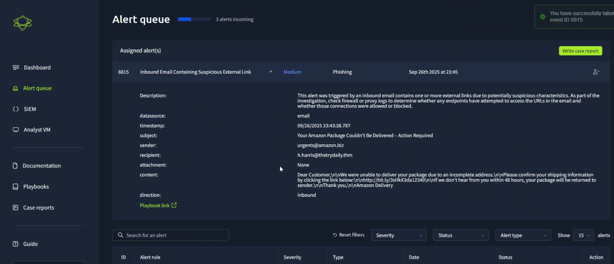

# Phishing Incident Response – SIEM Project

## Overview
This project simulates detecting and responding to multiple phishing email alerts using a SIEM platform.  
During the investigation, a total of **5 alerts** were observed:  
- Some were classified as **False Positives** (legitimate activity flagged as suspicious).  
- At least one was confirmed as a **True Positive** phishing attempt.  

The project covers the full workflow: detection, classification, analysis of false positives and true positives, and remediation steps.  
This project was made using the website [TryHackMe](https://tryhackme.com/).

## Table of Contents
- [Detection](#step-1-detection)
- [Classification](#step-2-classification)
- [False Positive Analysis](#step-3-false-positive-analysis)
- [True Positive Analysis](#step-4-true-positive-analysis)
- [Remediation](#step-5-remediation)
- [Lessons Learned](#lessons-learned)

---

### Step 1: Detection
The SIEM triggered an alert for a suspicious email received by a user.

**Indicators Observed:**
- Subject: "Complete your final profile setup"
- Sender: onboarding@hrconnex.thm
- Alert type: Phishing detection

**Outcome:**  
This alert was later identified as a **False Positive** (benign email, no malicious activity).  
Proceeded to [False Positive Analysis](#step-3-false-positive-analysis).

---

### Step 2: Classification
After detecting the alerts in the SIEM, each alert was analyzed to determine whether it was a **True Positive (TP)** or a **False Positive (FP)**.

**Total Alerts Observed:** 5  
- **True Positives:** 3  
- **False Positives:** 2  

**Classification Process:**
1. **Email Header Analysis**
   - Verified sender domains for legitimacy.

2. **Content Inspection**
   - Reviewed email subject, body, and links.
   - Checked for suspicious or obfuscated URLs.

3. **Threat Intelligence & IOCs**
   - Cross-referenced sender IPs and URLs with known malicious indicators.
   - Confirmed phishing signatures where applicable.

4. **User Interaction**
   - Checked whether recipients clicked links or downloaded attachments.

**Outcome:**
- **False Positives (2 alerts):** Legitimate emails flagged by the SIEM. No malicious content detected.  
- **True Positives (3 alerts):** Confirmed phishing attempts with malicious links or attachments targeting users.

**Next Steps:**  
- Proceed to [False Positive Analysis](#step-3-false-positive-analysis) for the benign alerts.  
- Proceed to [True Positive Analysis](#step-4-true-positive-analysis) for the confirmed phishing attempts.

---

### Step 3: False Positive Analysis

**Subject:** Complete your final profile setup  
**Sender:** onboarding@hrconnex.thm  

**Why the alert was triggered:**  
- The email contained url like "https://hrconnex.thm/" that matched phishing detection rules.   
- The sender domain was new to the recipient, triggering caution rules.

**Analysis:**  
- Confirmed that links point to the official internal portal.
- Cross-checked with threat intelligence: no IOCs found.

**Screenshots:**

**1. SIEM Alert Overview:**  
Shows the alert triggered for the suspicious email.  

**2. Email Headers / Technical Details:**  
Displays SPF/DKIM/DMARC and results. 

**Summary Table:**
| Field               | Observation                      |
|--------------------|----------------------------------|
| Subject             | Complete your final profile setup |
| Sender              | onboarding@hrconnex.thm          |
| URLs                 | Internal portal                 |
| Links                | Safe and doesn't have malware   |
| Action Required      | None                             |

**Key Takeaway from this False Positive:**  
- Investigate alerts carefully before taking action; not all alerts are threats.

### Step 4: True Positive Analysis
During the investigation, **3 alerts were confirmed as True Positives** (actual phishing attempts).  

---

## Alert 1
### Phishing E-mail Attempt

**Alert Details:** 
**Subject:** You Amazon Package Couldn't Be Delivered - Action Required
**Sender:**   uregents@amazon.biz

**Why the alert was triggered:**  
- Email contained urgent language prompting users to take actions.  
- Links pointed to a suspicious external URL (`http://bit.ly/3sHkX3da12340\n\nlf`).  
- Sender domain did not match official company domain.  

**Screenshots:**  
  

  

**Outcome / Action Taken:**  
- Alert confirmed as a phishing attempt.  
- No user interaction due to firewall block.

---

## Alert 2
### Firewall Blocked Attempt

**Alert Details:** 
- **Type:** Firewall alert – outbound connection blocked  
- **Source IP (internal user):** `10.20.2.17`  
- **Destination IP (malicious site):** `67.199.248.11`  
- **Source Port:** `34257`  
- **Destination Port:** `80` (HTTP)  
- **Trigger:** User clicked a phishing link, firewall blocked the connection to the external malicious host.  

**Why the alert was triggered:**  
- User attempted to click a phishing link from a malicious email.  
- The firewall detected an outbound HTTP connection to a URL that is listed in the blacklist.  
- Destination IP (`67.199.248.11`) is known to be malicious.    

**Screenshots:**  
**1. Firewall Alert Overview:**  
Shows the blocked outbound connection attempt.  
  

**Summary Table:**  

| Field          | Observation                           |
|----------------|---------------------------------------|
| Source IP      | 10.20.2.17 (employee workstation)      |
| Destination IP | 67.199.248.11 (malicious host)         |
| Source Port    | 34257                                 |
| Destination    | 80 (HTTP)                             |
| Action Taken   | Blocked by firewall, user notified     |

**Outcome / Action Taken:**  
- Firewall successfully blocked the connection to the malicious host.  
- No payload was downloaded, and no compromise occurred.  
- User was notified and advised on phishing awareness.  

### Step 5: Remdiation
*(To be filled in…)*

### Step 6: Lessons Learned
- Always check SPF/DKIM/DMARC headers.
- User awareness is critical.
- Always check domains and sub-domains.
- SIEM tuning reduces false positives.
